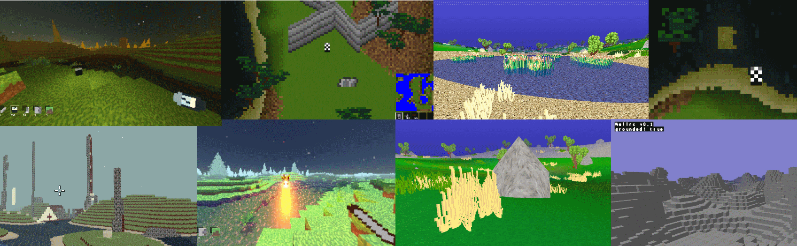

# Hello, my name is Jackson Levine

Welcome to my Github! I program as a job and a hobby.

Feel free to check out and take from whatever you find interesting! Here are some of my personal favorites:

## ["Distant Garden", 3D Procedural Game rendered with OpenGL (Originally "Cleveland" in C++ and several other iterations before)](https://github.com/jacksonlevine/distgard)

The current latest iteration of a long self-educational journey to create a block-based world like Minecraft from scratch with no game engine for rendering, using only graphics APIs. Currently migrating a majority of the business logic to take advantage of Bevy Engine!

## [PictoSend RS](https://github.com/jacksonlevine/pictosend-rs)

A basic pictochat inspired messaging app with a primitive OpenGL UI, that I wrote to learn Rust.

## [Powder Game](https://github.com/jacksonlevine/cpowdergame)

A falling sand simulation game written in C.

## [Mimodo](https://github.com/jacksonlevine/cameratest/tree/raycast)

An interesting game demo using raycasting.

## [Boris Lang](https://github.com/jacksonlevine/small-lambda-calc-interpreted-lang)

A simple interpreted language with a blend of Lisp and C-style syntax.

## [Multitrack Stems Player](https://github.com/jacksonlevine/multitrack-audio-player)

A backend and frontend framework to serve individual stems of songs, and play them together with "Solo" and "Mute" options for each track.

Thank you for checking out my Github! Feel free to contact me at jack@netbug.us
Have a great day.

<!--
**jacksonlevine/jacksonlevine** is a ✨ _special_ ✨ repository because its `README.md` (this file) appears on your GitHub profile.

Here are some ideas to get you started:

- 🔭 I’m currently working on ...
- 🌱 I’m currently learning ...
- 👯 I’m looking to collaborate on ...
- 🤔 I’m looking for help with ...
- 💬 Ask me about ...
- 📫 How to reach me: ...
- 😄 Pronouns: ...
- ⚡ Fun fact: ...
-->
