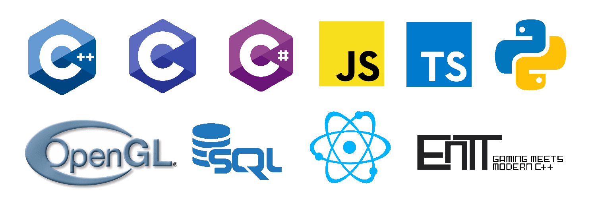

# Hello, my name is Jackson Levine. I love programming!

Welcome to my Github! I primarily work in C++, JavaScript, and sometimes Python, and I program a lot of things, including game prototypes and tech demos.

Feel free to check out and take from whatever you find interesting! Here are some of my personal favorites:

## [MimosDono 23](https://github.com/jacksonlevine/MimosDono23)

Code name for iteration #23 of an open-world sandbox game with procedural terrain. Includes a Python modding API and multiplayer with a "head" server for storing public server addresses and delivering to the client.

## [Boris Lang](https://github.com/jacksonlevine/small-lambda-calc-interpreted-lang)

A simple interpreted language with a blend of Lisp and C-style syntax.

## [Wellrc](https://github.com/jacksonlevine/wellrc)

Another attempt at reliable AABB collisions in a voxel world. C++/OpenGL.

## [Multitrack Stems Player](https://github.com/jacksonlevine/multitrack-audio-player)

A backend and frontend framework to serve individual stems of songs, and play them together with "Solo" and "Mute" options for each track.

## [RaceCar](https://github.com/jacksonlevine/racecar)

A clone of "Pole Position" written with C++/OpenGL that loads tracks/courses from bezier curves described in SVG files. As such, users can easily add their own tracks.

## [CppGame](https://github.com/jacksonlevine/cpp-game)

A 2D game with pseudo-3D effects, written in C++ with the SFML library.

## [WebsiteTemplate](https://github.com/jacksonlevine/htmxnext-not-)

A basic but full-featured full-stack app with C++/CROW backend and added user/session storage in database, registered-user-only content, password hashing with libsodium, and HTMX front-end.

Thank you for checking out my Github! Feel free to contact me at jack@netbug.us
Have a great day.

<!--
**jacksonlevine/jacksonlevine** is a ✨ _special_ ✨ repository because its `README.md` (this file) appears on your GitHub profile.

Here are some ideas to get you started:

- 🔭 I’m currently working on ...
- 🌱 I’m currently learning ...
- 👯 I’m looking to collaborate on ...
- 🤔 I’m looking for help with ...
- 💬 Ask me about ...
- 📫 How to reach me: ...
- 😄 Pronouns: ...
- ⚡ Fun fact: ...
-->
